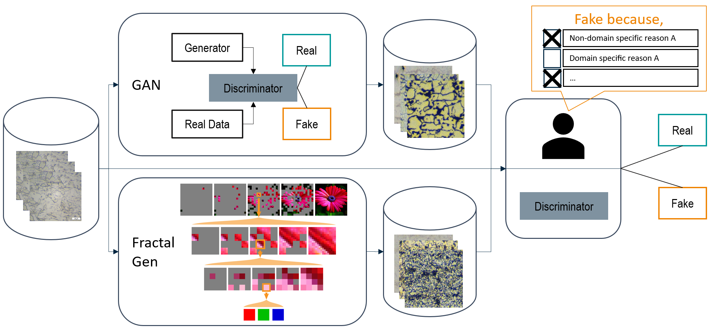

# Comparing the visual quality of deep generative models for steel microstructures
This repository provides the PyTorch code used in our expert study to compare the perceived realism of synthetic steel microstructures of two deep generative models:

```
@InProceedings{wentzien2026visualqualitysteelmicrostructures,
author="Wentzien, Marcel and Ingber, Jerome and Schl{\"o}tterer, J{\"o}rg and Schmalzried, Dirk",
editor="Braun, Tanya and Paa{\ss}en, Benjamin and Stolzenburg, Frieder",
title="Comparing the Visual Quality of Deep Generative Models for Steel Microstructures",
booktitle="KI 2025: Advances in Artificial Intelligence",
year="2026",
publisher="Springer Nature Switzerland",
address="Cham",
pages="278--285",
isbn="978-3-032-02813-6",
doi="10.1007/978-3-032-02813-6_23"
}
```

## Visual Abstract

(FractalGen image displayed as in the original [paper](https://arxiv.org/abs/2502.17437).)

## Deep generated models 
Original FractalGen repository: [https://github.com/LTH14/fractalgen](https://github.com/LTH14/fractalgen)

Original StyleGANv2-Ada code is part of the StyleGANv3 repository: [https://github.com/NVlabs/stylegan3](https://github.com/NVlabs/stylegan3)

## Training a model
The following code assumes you have working installations of the original repositories. They were tested as SLURM script on NVIDIA A100 GPUs.

### FractalGen
Example script for training 800 epochs on 256x256 images of 30 different steel alloys.
```
OUTPUT=/home/models/fractalgen/
DATA=/home/data/

torchrun --nproc_per_node=2 --nnodes=1 --node_rank=0 --master_addr=${MASTER_ADDR} --master_port=${MASTER_PORT} \
main_fractalgen.py \
--model fractalmar_base_in256 --img_size 256 --num_conds 5 --guiding_pixel \
--batch_size 32 --eval_freq 80 --save_last_freq 10 --class_num 30 \
--epochs 800 --warmup_epochs 1 \
--blr 5.0e-4 --weight_decay 0.005 --r_weight 1. --attn_dropout 0.1 --proj_dropout 0.1 --lr_schedule cosine \
--gen_bsz 256 --num_images 1272 --num_iter_list 64,16,16 --cfg 10.0 --cfg_schedule linear --temperature 1.1 \
--output_dir $OUTPUT \
--data_path $DATA --num_worker 4 --grad_checkpointing --online_eval
```

### StyleGANv2-Ada
```
OUTPUT=/home/models/stylegan/
DATA=/home/data/

python train.py --outdir=$OUTPUT --cfg=stylegan2 --data=$DATA --batch=32 --gpus=2 --gamma=8 --target=0.5 --aug=ada --kimg=5000 --tick=2 --snap=30 --nobench=True --workers=2 --metrics=kid50k_full --mirror=1
```

## Generating new microstructure images
### FractalGen
Example script for generating new microstructural images based on FractalGen's [demo](https://github.com/LTH14/fractalgen/blob/main/demo/run_fractalgen.ipynb). Ensure to put `generate_fractalgen.py` in the original FractalGen repository as it depends on the original code. We found it best to run the script on a SLURM cluster. On SLURM cluster run from within a cloned FractalGen repository:
```
torchrun --nproc_per_node=1 --nnodes=1 --node_rank=0 --master_addr=${MASTER_ADDR} --master_port=${MASTER_PORT} \
generate_fractalgen.py 
```

### StyleGANv2-Ada
Ensure a fully trained model pkl-file is located under `model/`.
Code assumes CUDA is available.
Then run
```
python src/generate_stylegan.py
```
to generate new images under `model/generated_fakes/`

## Classifying the images with the GAN's discriminator
In order to classify images in the `data/` folder using the GAN's discriminator, ensure to correctly set up all paths in `src/discriminate_images.py`. This includes providing a trained StyleGANv2 model in `model/`. 

The `class_fake` subfolder stubs are only required for simplified dataloading using pytorch's ImageFolder.

Ensure PyTorch and Torchvision are installed, see [Pytorch Website](https://pytorch.org/get-started/locally/)

Then run
```
python src/discriminate_images.py
```
By default the results will be stored in `evaluate/discriminator/*/discriminations.csv` where `*` is the same subfolder as provided under `data/`.

## Classifying the images as human expert using the custom UI
Either use the provided sample data or ensure that your own data is correctly located in the subfolders under `data/`.

Ensure [PyQt6](https://pypi.org/project/PyQt6/) is installed.

Then run 
```
python src/real_or_fake_ui.py
```
By default the results will be stored in `evaluate/guesses.csv`.
